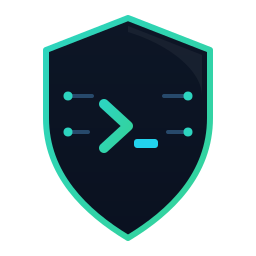

<p align="center">
  
</p>

<h1 align="center">Sentinel-Agent</h1>

<p align="center">
  The on-device AI ops agent — a <b>secure isolation execution layer</b> between cloud LLMs and your private infrastructure.
</p>

<p align="center">
  
  
  
  
</p>

<p align="center">
  <b>English</b> · <a href="README.zh-CN.md">简体中文</a>
</p>

---

`guard run "<natural-language task>"` — a local model translates a fuzzy intent into concrete
commands, the Policy Guard screens them, and you confirm before anything runs.
**Sensitive data physically never leaves the machine.**

Modern cloud LLMs are powerful but teams increasingly forbid pasting Kubernetes configs,
private code, or DB credentials into them. Sentinel-Agent is the **compliant exit**: keep the
high-level reasoning wherever you like, but let an on-device model do the privileged work behind
a security fence.

## How you use it

Two modes, same core. Pick per situation.

### Mode 1 — CLI (standalone, fully local)

Talk to it directly in your terminal. Best for interactive ops, scripts, and air-gapped boxes.

```bash
go build -o bin/guard ./cmd/guard

# no model needed — the mock backend runs the whole pipeline offline
./bin/guard run --provider mock "diagnose not-ready pods in the default namespace"

# screen a single command against the security fence
./bin/guard policy check "kubectl delete pods --all"   # -> BLOCK

# plan-only by default; raise the autonomy level to act (Claude-Code/Codex-style tiers)
./bin/guard run --mode readonly "show logs for the payment service"   # runs reads, asks on writes
./bin/guard run --mode auto     "restart the nginx deployment"        # runs reads + writes
```

Permission tiers (`--mode`) combine with the Policy Guard verdict:

| verdict \ mode      | `plan` | `readonly` | `auto` | `full` |
|---------------------|:------:|:----------:|:------:|:------:|
| allow (read-only)   | show   | run        | run    | run    |
| confirm (mutating)  | show   | ask        | run    | run    |
| block (dangerous)   | show   | refuse     | refuse | run ⚠  |

### Mode 2 — MCP server (cloud orchestrator + on-device safe execution)

Run `guard mcp` and register it in any MCP client (Claude Desktop, Cursor, Codex, ...).
The **on-device model is a skill/tool of the cloud model**. The cloud orchestrator does the
high-level planning; Sentinel runs the concrete steps locally and **desensitizes** the output
before returning it, so the cloud model can reason over results without ever seeing raw secrets.

```
 Cloud LLM (planner)  — Claude Desktop / Cursor / Codex
        │  run_task / execute_step("kubectl logs ...")   ← only the intent leaves
        ▼
   guard mcp   (this machine = executor + sanitizer)
   ├─ LFM Engine   → plan / refine with the local model
   ├─ Local RAG    → reads kube/ssh context     (never sent out)
   ├─ Policy Guard → allow / confirm / block  ×  mode (plan/readonly/auto/full)
   └─ Redactor     → strips keys, tokens, creds, emails
        │  desensitized result only                      → back to the cloud planner
        ▼
   cloud plans the next step  ──▶  loop
```

This is the **compliant exit**: the powerful model stays in the cloud, the privileged work and the
raw data stay on the machine, and only sanitized observations cross the boundary.

Register it (Claude Desktop / generic MCP client `mcpServers` entry):

```jsonc
{
  "mcpServers": {
    "sentinel-agent": {
      "command": "guard",
      "args": ["mcp"],
      "env": { "SENTINEL_PROVIDER": "ollama", "SENTINEL_MODEL": "lfm2.5" }
    }
  }
}
```

Or with Codex: `codex mcp add sentinel-agent -- guard mcp`

Tools exposed over MCP: `run_task` (plan a task locally), `execute_step` (run one command under
the guard + mode, returning **redacted** output), `policy_check`, `local_context`, `list_skills`.
The server's autonomy is set by `SENTINEL_MODE` (default `readonly`); the MCP client's own
tool-approval prompt is the human gate for `ask`-tier (mutating) steps.

## Architecture — three-layer filter

```
        guard run "diagnose not-ready pods in default"
                          │
   ① Intent Bridge   ─────▼─────  natural-language entrypoint (CLI / MCP)
   ② LFM Engine      ─────▼─────  local inference, data stays on device
        • Local RAG: reads ~/.kube, ~/.ssh as background (non-secret only)
        • intent alignment: intent -> shell / kubectl
        • providers: ollama | llamacpp | mlx | mock (OpenAI-compatible)
   ③ Policy Guard    ─────▼─────  allow / confirm / block
        • regex + semantic interception (drop / --all / rm -rf ...)
        • human-in-the-loop confirmation
                          │
                    run / refuse / downgrade
```

Inference backends are decoupled from orchestration: every backend speaks the OpenAI-compatible
protocol, so switching is configuration, not code. See [docs/ARCHITECTURE.md](docs/ARCHITECTURE.md)
and the [Tool Call protocol](docs/tool-call-protocol.md).

## Inference backends

Switch via `--provider` or `SENTINEL_PROVIDER`. All speak OpenAI-compatible `/v1/chat/completions`.

| provider   | cross-platform | notes                                         | default endpoint              |
|------------|----------------|-----------------------------------------------|-------------------------------|
| `ollama`   | all            | **recommended default**; built-in model mgmt  | `http://localhost:11434/v1`   |
| `llamacpp` | all            | single binary, no daemon, auditable (GGUF)    | `http://localhost:8080/v1`    |
| `mlx`      | macOS only     | best performance on Apple Silicon             | `http://localhost:8080/v1`    |
| `mock`     | all            | no-model offline demo backend (CI / first run)| —                             |

> Model weights are never shipped with the repo (`*.gguf` / `*.safetensors` / `models/` are
> gitignored). Point `SENTINEL_MODEL` at your own LFM 2.5 build.

## Security model

- **Policy Guard**: every command is graded `allow` / `confirm` / `block` before it can run.
  Anything matching no rule defaults to `confirm` — unknown actions always need a human.
- **Permission tiers**: a Claude-Code/Codex-style `--mode` (`plan`/`readonly`/`auto`/`full`)
  combines with the verdict to decide run / ask / refuse. Default CLI mode is `plan`; default
  MCP mode is `readonly`.
- **Redaction (desensitization)**: any executed output that may leave the machine is sanitized
  first — private keys, JWTs, cloud keys, kubeconfig secrets, credentials in URLs, emails, and
  long base64 blobs are stripped. In the cloud-planner loop the privacy guarantee is **"only
  desensitized data leaves"**, and the redactor is the linchpin that enforces it.
- **Intent downgrade**: if the local model can't produce a plan, Sentinel **never** silently
  escalates the raw task off-device — it surfaces the downgrade to you/the client instead.
- **Local RAG never exfiltrates**: only non-secret identifiers (e.g. the current kube context)
  are read into the prompt; credentials and file contents are never read or transmitted.

## Roadmap

- **Phase 1 · MVP (current)** — Intent Bridge, on-device engine (OpenAI-compatible), K8s skill,
  Policy Guard, MCP server.
- **Phase 2 · skill ecosystem** — Database (MySQL/PG), Cloud CLI (AWS/Aliyun), Git; richer intent downgrade.
- **Phase 3 · enterprise compliance** — SSO, audit logging (operation type only, never data), offline mode.

## Development

```bash
make build   # build to bin/guard
make test    # go test ./...
make vet     # go vet ./...
make run     # run a sample task with the mock backend
```

No third-party runtime dependencies (standard library only) — for a security tool, a smaller
supply-chain surface is a deliberate trade-off.

## License

MIT — see [LICENSE](LICENSE).

> Alpha: interfaces and rules may still change. Do not use `--execute` against production without
> reviewing the plan first.
