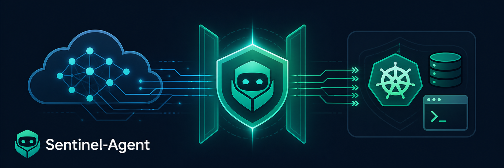
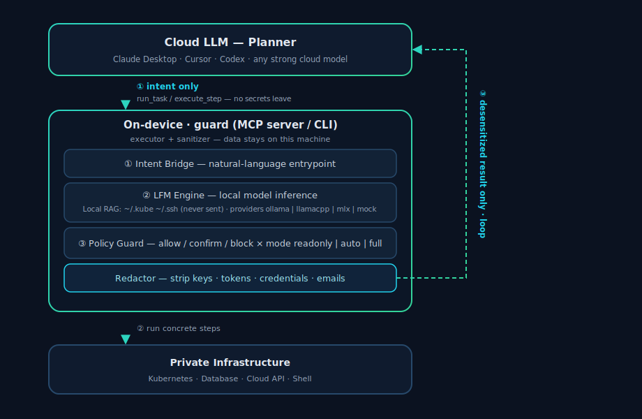

<p align="center">
  
</p>

<h1 align="center">Sentinel-Agent</h1>

<p align="center">
  The on-device AI ops agent — a <b>secure isolation execution layer</b> between cloud LLMs and your private infrastructure.
</p>

<p align="center">
  
  
  
  
</p>

<p align="center">
  <b>English</b> · <a href="README.zh-CN.md">简体中文</a>
</p>

---

`guard run "<natural-language task>"` — a local model translates a fuzzy intent into concrete
commands, the Policy Guard screens them, and you confirm before anything runs.
**Sensitive data physically never leaves the machine.**

Modern cloud LLMs are powerful but teams increasingly forbid pasting Kubernetes configs,
private code, or DB credentials into them. Sentinel-Agent is the **compliant exit**: keep the
high-level reasoning wherever you like, but let an on-device model do the privileged work behind
a security fence.

## Demo

**CLI** — natural language → on-device LFM2.5 → Policy Guard → live `kubectl` against a real
minikube cluster (the `ImagePullBackOff` pod is real); destructive commands are refused.

<p align="center">
  
</p>

**Sentinel Skill** — a cloud agent triages a real production incident through `guard skill` (JSON
protocol): a `payment-api` deploy is crash-looping in the `shop` namespace. The agent reads non-secret
context, plans on-device, runs read-only commands with redacted JSON output (surfacing the root cause —
a missing env var), gets a remediation gated behind human approval, and is blocked from a bulk delete.

<p align="center">
  
</p>

<sub>Reproduce: <a href="docs/demo-cli.sh">docs/demo-cli.sh</a> · <a href="docs/demo-skill.sh">docs/demo-skill.sh</a> (recorded with asciinema + agg)</sub>

## Install (macOS-first)

Out-of-the-box: install the small CLI, install the engine once, then just run — the on-device
model downloads itself on first use. No Ollama, no manual model wrangling.

```bash
# 1. the CLI itself (small — no model bundled inside)
go install github.com/xiaokhkh/sentinel-agent/cmd/guard@latest

# 2. the local inference engine, once
brew install llama.cpp

# 3. run — first run auto-fetches a small LFM2.5 model (~0.8 GB) and serves it locally
guard run "diagnose not-ready pods in the default namespace"
```

`guard` downloads the GGUF itself — **proxy-aware** (Go HTTP honors `HTTPS_PROXY`, unlike llama.cpp's
`-hf`) — into `~/.sentinel/models/`, then runs `llama-server -m ...` bound to `127.0.0.1`. Behind a
firewall, set a mirror via `HF_ENDPOINT` or just rely on your proxy. Pick a quant with `SENTINEL_QUANT`
(default `Q4_K_M`). Manage it with:

```bash
guard model    # show model / engine / endpoint status
guard serve    # run the engine in the foreground
guard stop     # stop the background engine
```

No engine yet, or just kicking the tires? `guard run --provider mock "..."` runs the whole
pipeline offline with a built-in mock backend.

## How you use it

Two modes, same core. Pick per situation.

### Mode 1 — CLI (standalone, fully local)

Talk to it directly in your terminal. Best for interactive ops, scripts, and air-gapped boxes.

```bash
go build -o bin/guard ./cmd/guard

# no model needed — the mock backend runs the whole pipeline offline
./bin/guard run --provider mock "diagnose not-ready pods in the default namespace"

# screen a single command against the security fence
./bin/guard policy check "kubectl delete pods --all"   # -> BLOCK

# readonly by default (runs reads, asks on writes); raise the tier to act
./bin/guard run --mode readonly "show logs for the payment service"   # runs reads, asks on writes
./bin/guard run --mode auto     "restart the nginx deployment"        # runs reads + writes
```

Permission tiers (`--mode`, Claude-Code/Codex-style) combine with the Policy Guard verdict:

| verdict \ mode      | `readonly` | `auto` | `full` |
|---------------------|:----------:|:------:|:------:|
| allow (read-only)   | run        | run    | run    |
| confirm (mutating)  | ask        | run    | run    |
| block (dangerous)   | refuse     | refuse | run ⚠  |

### Mode 2 — Sentinel Skill (cloud agent + on-device safe execution)

Install the Sentinel Skill in a cloud agent (Claude, Codex, Cursor, ...). The Skill gives the agent
a safe local ops capability: the cloud model does high-level planning, Sentinel runs concrete steps
locally, and outputs are **desensitized** before returning. The Skill communicates with the local
runtime through the `guard skill` CLI JSON interface.

```
 Cloud LLM (planner)  — Claude Desktop / Cursor / Codex
        │  guard skill plan / exec("kubectl logs ...")   ← only the intent leaves
        ▼
   Sentinel local runtime   (this machine = executor + sanitizer)
   ├─ LFM Engine   → plan / refine with the local model
   ├─ Local RAG    → reads kube/ssh context     (never sent out)
   ├─ Policy Guard → allow / confirm / block  ×  mode (plan/readonly/auto/full)
   └─ Redactor     → strips keys, tokens, creds, emails
        │  desensitized result only                      → back to the cloud planner
        ▼
   cloud plans the next step  ──▶  loop
```

This is the **compliant exit**: the powerful model stays in the cloud, the privileged work and the
raw data stay on the machine, and only sanitized observations cross the boundary.

Wire the Skill to the local runtime by installing `guard` on the machine where the agent can run
local commands:

```bash
go install github.com/xiaokhkh/sentinel-agent/cmd/guard@latest
guard skill context
```

Skill package: [docs/skills/sentinel-agent/SKILL.md](docs/skills/sentinel-agent/SKILL.md).
It is the agent-facing contract: when to inspect local context, when to plan, when to execute, and
when to stop for approval.

CLI calls used by the Skill: `guard skill context`, `guard skill plan`, `guard skill exec`, and
`guard skill policy`.
The Skill runtime's autonomy is set by `SENTINEL_MODE` (default `readonly`); the agent client's
own tool-approval prompt is the human gate for `ask`-tier (mutating) steps.

## Architecture &amp; flow

<p align="center">
  
</p>

The cloud planner sends only an intent; the on-device layers (Intent Bridge → LFM Engine →
Policy Guard → Redactor) plan and execute locally, and only the **desensitized** result loops
back. Inference backends are decoupled from orchestration: every backend speaks the OpenAI-compatible
protocol, so switching is configuration, not code. See [docs/ARCHITECTURE.md](docs/ARCHITECTURE.md)
and the [Tool Call protocol](docs/tool-call-protocol.md).

## Inference backends

Switch via `--provider` or `SENTINEL_PROVIDER`. All speak OpenAI-compatible `/v1/chat/completions`.

| provider   | cross-platform | notes                                         | default endpoint              |
|------------|----------------|-----------------------------------------------|-------------------------------|
| `ollama`   | all            | **recommended default**; built-in model mgmt  | `http://localhost:11434/v1`   |
| `llamacpp` | all            | single binary, no daemon, auditable (GGUF)    | `http://localhost:8080/v1`    |
| `mlx`      | macOS only     | best performance on Apple Silicon             | `http://localhost:8080/v1`    |
| `mock`     | all            | no-model offline demo backend (CI / first run)| —                             |

> Model weights are never shipped with the repo (`*.gguf` / `*.safetensors` / `models/` are
> gitignored). Point `SENTINEL_MODEL` at your own LFM 2.5 build.

## Security model

- **On-device security boundary**: cloud agents may plan, but sensitive data must not be
  persisted, transmitted, or silently escalated to the cloud. Raw kubeconfigs, SSH keys,
  cloud tokens, DB credentials, private source, and unredacted production output stay on
  the machine. See [docs/on-device-security.md](docs/on-device-security.md).
- **Policy Guard**: every command is graded `allow` / `confirm` / `block` before it can run.
  Anything matching no rule defaults to `confirm` — unknown actions always need a human.
- **Permission tiers**: a Claude-Code/Codex-style `--mode` (`readonly`/`auto`/`full`)
  combines with the verdict to decide run / ask / refuse. Default is `readonly` (CLI and Skill):
  read-only commands run, mutations ask, dangerous commands are refused.
- **Redaction (desensitization)**: any executed output that may leave the machine is sanitized
  first — private keys, JWTs, cloud keys, kubeconfig secrets, credentials in URLs, emails, and
  long base64 blobs are stripped. In the cloud-planner loop the privacy guarantee is **"only
  desensitized data leaves"**, and the redactor is the linchpin that enforces it.
- **Intent downgrade**: if the local model can't produce a plan, Sentinel **never** silently
  escalates the raw task off-device — it surfaces the downgrade to you/the client instead.
- **Local RAG never exfiltrates**: only non-secret identifiers (e.g. the current kube context)
  are read into the prompt; credentials and file contents are never read or transmitted.

## Structured memory

`guard` remembers how to reach your systems in `~/.sentinel/config.json` — **paths, references,
and facts only; never secrets**:

```bash
guard config set kubernetes.kubeconfig ~/.kube/config
guard config set kubernetes.namespace payments
guard remember "payment service runs in namespace payments"
guard config        # show the store
guard memory        # list remembered facts
```

When a task needs access info the agent doesn't have yet (e.g. no kubeconfig), the **system prompt**
tells the model to ask you in chat instead of guessing — and the answer is saved for next time:

```
$ guard run "check my k8s pods"
Which kubeconfig should I use?
> ~/.kube/config
saved to ~/.sentinel/config.json (kubernetes.kubeconfig)
...
```

The remembered context (kube context/namespace + facts, non-secret) is injected into the model
prompt and used to construct commands.

## Roadmap

- **Phase 1 · MVP (current)** — Intent Bridge, on-device engine (OpenAI-compatible), K8s skill,
  Policy Guard, Sentinel Skill.
- **Phase 2 · skill ecosystem** — Database (MySQL/PG), Cloud CLI (AWS/Aliyun), Git; richer intent downgrade.
- **Phase 3 · enterprise compliance** — SSO, audit logging (operation type only, never data), offline mode.

## Development

```bash
make build   # build to bin/guard
make test    # go test ./...
make vet     # go vet ./...
make run     # run a sample task with the mock backend
```

No third-party runtime dependencies (standard library only) — for a security tool, a smaller
supply-chain surface is a deliberate trade-off.

## License

MIT — see [LICENSE](LICENSE).

> Alpha: interfaces and rules may still change. Do not use `--execute` against production without
> reviewing the plan first.
